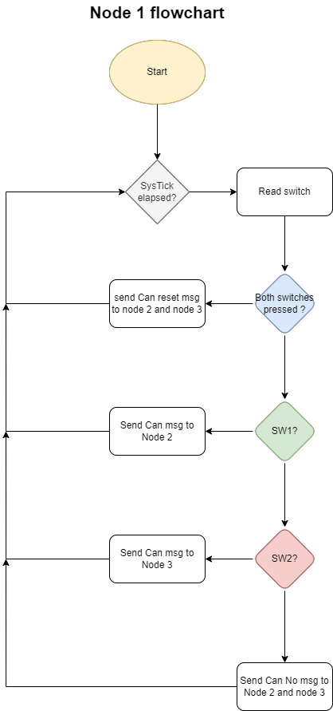
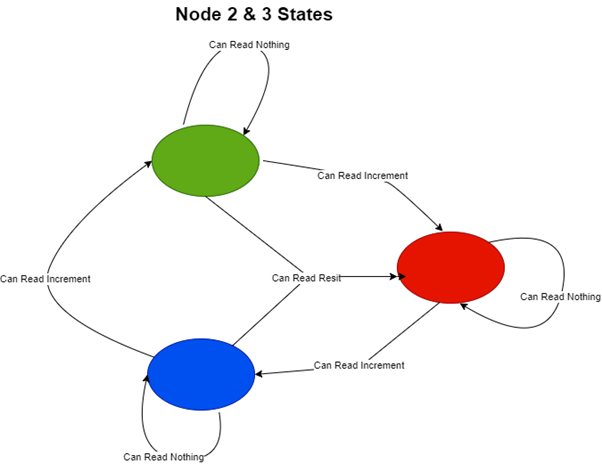
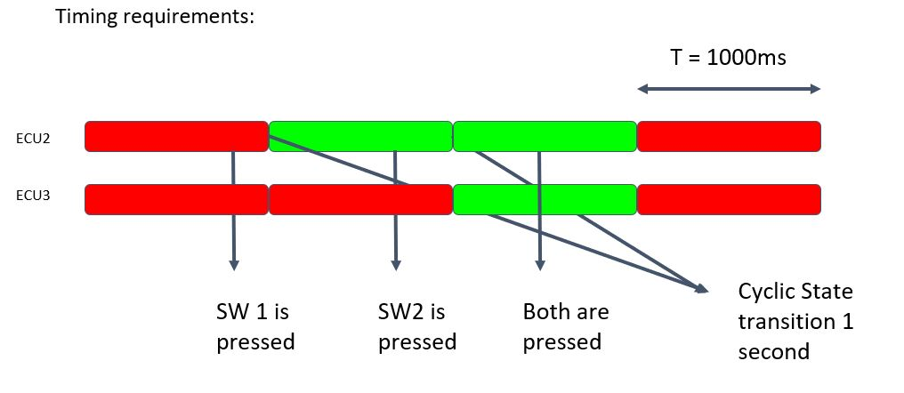
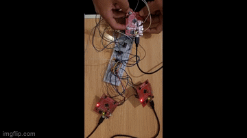
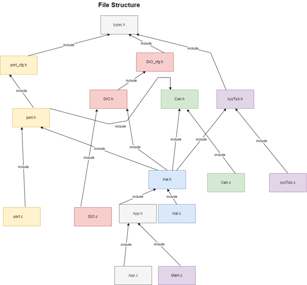

# Background
The project attempts to create a communication system between three Tiva’s through
CAN protocol while complying to the AUTOSAR standardized software architecture
and level of abstraction.

# Description
The project is comprised of three TivaC MCUs. Each one of them representing an ECU and all of them communicating via a
CAN bus. ECU 1 should send commands to the other two and they respectively should perform certain tasks based on these commands.
The tasks are controlled by a state machine which represents the changing of a state based on the change of the LED color.
The 

ECU 1 has the following functionality: 
   * Read the input switches (the on-board switches). 
   * Send a command on the CAN network based on the switch's states. 
   * SW1 controls ECU2 and SW2 controls ECU3. 
   * ECU 1 sends a message each 500 ms 

And this functionality can be highlighted in the following flowchart

  

ECU 2/3 has the following functionality:
   * ECU 2/3 State machines are periodic tasks with 10ms periodicities
   * Read the commands from the CAN networks. 
   * Execute the state machine as the following: 
      - Move to the next state (clockwise) whenever the SW is pressed
      - If both are pressed. The output on both ECUs will return to default (RED)
      - Only switch states with periodicity of one second

The following state diagram depicts the described state machine

  

Timing requirements for ECUs 2 and 3 can be seen below

  

A demo for the project can be seen below and full videos [here](https://drive.google.com/drive/folders/1t7Q7SWvgzLtVmZySS7GUWDMJEL9s6S6S)

  

# Goal
The aim of this project was to demonstrate compliance to AUTOSAR architecture through the execution of the tasks described above.
The DIO and PORT drivers used in the project were written while adhering as closely as possible to AUTOSAR SWS.
Moreover, the file architecture used was implemented with abstraction and layered architecture in mind, where the hardware specific components are arranged together below the application and service layers (mainly CAN in this project) and this also can be seen below

  

# Usage notes
* This project was built using Keil microvision v5 on the Tiva tm4c123gh6pm microcontroller
* To change the LED or buttons used, the IDs of said pins must be changed in the DIO_CFG configuration file.
* Pin IDs are counted sequentially for all ports. Meaning, Port B pin 0 would be Pin 9, counting after the 8 pins of Port A. And so on for all the ports.

